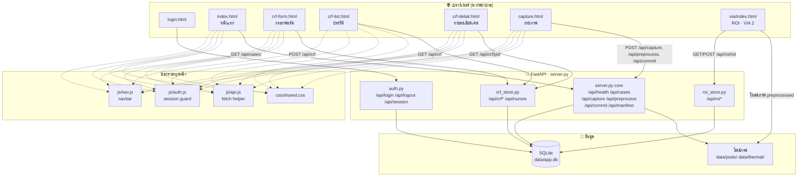
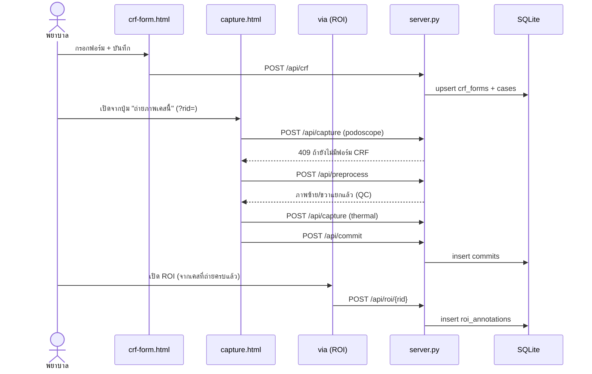

---
tags:
  - capture-app
  - architecture
  - overview
---

# Capture App — Overview

ระบบเก็บข้อมูลความเสี่ยงเท้าเบาหวานหน้างาน (local-first, รันบนเครื่องเดียวที่ รพ.พุทธชินราช) รวม
แบบฟอร์ม CRF, การถ่ายภาพ podoscope/thermal, และการมาร์ก ROI ด้วย VIA 2 เข้าไว้ในเว็บแอปเดียว หลังบ้าน
เป็น FastAPI + SQLite ทั้งหมด ไม่พึ่งอินเทอร์เน็ตตอนรัน

โค้ดอยู่ที่ `capture_app/` ใน repo นี้ (ดู `capture_app/README.md` สำหรับวิธีรัน)

---

## ภาพรวมสถาปัตยกรรม



---

## แผนที่หน้าเว็บ

| หน้า | เส้นทาง | หน้าที่ | ผูกกับ API |
|---|---|---|---|
| เข้าสู่ระบบ | `/login.html` | ใส่รหัสผ่านทีมเดียว | `/api/login` |
| หน้าแรก | `/` (`index.html`) | แดชบอร์ด 3 การ์ด + picker ทำ ROI | `/api/crf`, `/api/cases`, `/api/roi` |
| กรอกฟอร์ม | `/crf-form.html` | ฟอร์ม CRF-07 + คำนวณ IWGDF/LOPS/PAD สด | `/api/session/new`, `/api/nurses`, `/api/crf` |
| ประวัติ | `/crf-list.html` | ตารางทุกเคส + export CSV | `/api/crf`, `/api/manifest`, `/api/roi` |
| รายละเอียดเคส | `/crf-detail.html?pid=` | ผลตรวจเต็ม + ปุ่มไปถ่ายภาพ/ทำ ROI | `/api/crf/{pid}`, `/api/manifest`, `/api/roi` |
| ถ่ายภาพ | `/capture.html?rid=` | ถ่าย podoscope+thermal, preprocess อัตโนมัติ | `/api/capture`, `/api/preprocess`, `/api/commit` |
| ROI | `/via/index.html?rid=` | มาร์กบริเวณเสี่ยงด้วย VIA 2 (third-party, ไม่แก้โค้ดหลัก) | `/api/roi/{rid}` |

ทุกหน้า (ยกเว้น `login.html`) โหลด `js/auth.js` ก่อนเสมอ — เช็ก `/api/session` แล้วเด้งไป login ถ้ายังไม่ล็อกอิน

---

## ลำดับงานหลัก (happy path)



---

## ฐานข้อมูล (SQLite — `data/app.db`)

```mermaid
erDiagram
  cases ||--o| crf_forms : "1 เคส = 1 ฟอร์ม"
  cases ||--o{ captures : "podoscope/thermal"
  cases ||--o{ preprocessing : "L/R"
  cases ||--o| commits : "สถานะรวม"
  cases ||--o| roi_annotations : "ผลมาร์ก ROI"

  cases {
    text research_id PK
    text created_at
  }
  crf_forms {
    text research_id PK_FK
    text nurse
    text nurse2
    text fields_json
    text derived_json
  }
  captures {
    text research_id FK
    text modality PK
    text raw_path
  }
  preprocessing {
    text research_id FK
    text side PK
    text path
  }
  commits {
    text research_id PK_FK
    text status
    text operator
  }
  roi_annotations {
    text research_id PK_FK
    text summary_json
    text project_json
  }
  nurses {
    text name PK
  }
  sessions {
    text token PK
    text expires_at
  }
  settings {
    text key PK
    text value
  }
```

`fields_json` / `derived_json` / `project_json` เก็บเป็น JSON blob แทนการ normalize เต็มรูปแบบ —
ตัดสินใจแบบ pragmatic เพราะฟอร์มมี ~30 ฟิลด์ ใช้ `json_extract()` ของ SQLite query ย้อนหลังได้ถ้าจำเป็น

---

## ระบบ Login

- รหัสผ่านเดียวใช้ร่วมกันทั้งทีม (ไม่ใช่ per-nurse account) — ตั้งผ่าน env var `APP_PASSWORD`
  ตอนรัน หรือให้ระบบสุ่มรหัสแล้วพิมพ์ขึ้น console ครั้งแรกที่ยังไม่เคยตั้ง
- เก็บ session แบบ cookie (`httpOnly`, `SameSite=Lax`) อายุ 12 ชม. ผูกกับตาราง `sessions`
- ป้องกันที่ **ชั้น API** เป็นหลัก (ทุก endpoint ที่แตะข้อมูลผู้ป่วยต้องมี cookie) ส่วนหน้าเว็บเองใช้
  `js/auth.js` เช็กแล้วเด้งไป `login.html` — เพียงพอเพราะ server bind แค่ `127.0.0.1` (เข้าจากเครื่องอื่นไม่ได้)

---

## ข้อจำกัดที่ตั้งใจตัดออกในเวอร์ชันนี้

- ไม่มี pagination ในหน้าประวัติ (`crf-list.html`) — พอสำหรับสเกลเก็บข้อมูล รพ. เดียว
- ไม่มี per-nurse identity ใน login — ใครทำอะไรอ้างอิงจากฟิลด์ `nurse`/`nurse2` ในฟอร์มเอง ไม่ใช่ auth
- ไม่มี TLS — ผูกกับการที่ bind `127.0.0.1` เท่านั้น ถ้าจะเปิดให้เครื่องอื่นในเครือข่ายเข้าถึง (`--host 0.0.0.0`)
  ต้องกลับมาทบทวนเรื่องนี้ใหม่
- โหมด "เปิดไฟล์ HTML ตรงๆ ไม่ง้อเซิร์ฟเวอร์" (DEMO mode เดิม) ใช้ไม่ได้แล้วเพราะทุกหน้าโดน auth guard

