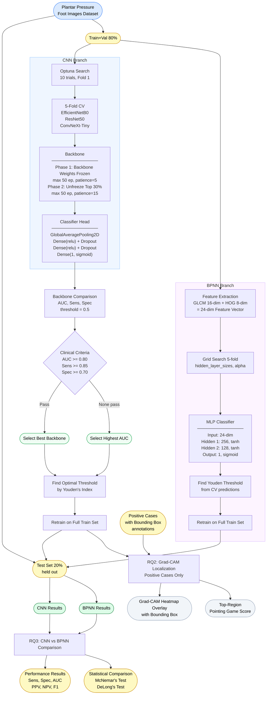

```mermaid
flowchart TD
    A([Plantar Pressure<br/>Foot Images Dataset]) --> C([Test Set 20%<br/>held out])
    A --> D([Train+Val 80%])

    D --> F["Optuna Search<br/>10 trials, Fold 1"]

    subgraph CNN ["CNN Branch"]
        F --> H["5-Fold CV<br/>EfficientNetB0<br/>ResNet50<br/>ConvNeXt-Tiny"]
        H --> H1["Backbone<br/>───────────────<br/>Phase 1: Backbone Weights Frozen<br/>max 50 ep, patience=5<br/>Phase 2: Unfreeze Top 30%<br/>max 50 ep, patience=15"]
        H1 --> H2["Classifier Head<br/>───────────────<br/>GlobalAveragePooling2D<br/>Dense(relu) + Dropout<br/>Dense(relu) + Dropout<br/>Dense(1, sigmoid)"]
    end

    D --> P1["Feature Extraction<br/>GLCM 16-dim + HOG 8-dim<br/>= 24-dim Feature Vector"]

    subgraph BPNN ["BPNN Branch"]
        P1 --> P2["Grid Search 5-fold<br/>hidden_layer_sizes, alpha"]
        P2 --> PARCH["MLP Classifier<br/>───────────────<br/>Input: 24-dim<br/>Hidden 1: 256, tanh<br/>Hidden 2: 128, tanh<br/>Output: 1, sigmoid"]
        PARCH --> PTHR["Find Youden Threshold<br/>from CV predictions"]
        PTHR --> P3["Retrain on Full Train Set"]
    end

    H2 --> RQ1["Backbone Comparison<br/>AUC, Sens, Spec<br/>threshold = 0.5"]
    RQ1 --> RQ1R{"Clinical Criteria<br/>AUC >= 0.80<br/>Sens >= 0.85<br/>Spec >= 0.70"}
    RQ1R -->|"Pass"| RQ1W([Select Best Backbone])
    RQ1R -->|"None pass"| RQ1W2([Select Highest AUC])
    RQ1W --> THR
    RQ1W2 --> THR

    THR["Find Optimal Threshold<br/>by Youden's Index"] --> RETRAIN["Retrain on Full Train Set"]
    RETRAIN --> C
    C --> CNN_RES([CNN Results])
    RETRAIN --> RQ2_CAM

    P3 --> C
    C --> BPNN_RES([BPNN Results])

    INP([Positive Cases<br/>with Bounding Box<br/>annotations]) --> RQ2_CAM
    RQ2_CAM["RQ2: Grad-CAM Localization<br/>Positive Cases Only"] --> RQ2A([Grad-CAM Heatmap Overlay<br/>with Bounding Box])
    RQ2_CAM --> RQ2C([Top-Region<br/>Pointing Game Score])

    CNN_RES --> RQ3["RQ3: CNN vs BPNN Comparison"]
    BPNN_RES --> RQ3
    RQ3 --> RQ3A([Performance Results<br/>Sens, Spec, AUC<br/>PPV, NPV, F1])
    RQ3 --> RQ3B([Statistical Comparison<br/>McNemar's Test<br/>DeLong's Test])

    style A fill:#dbeafe,stroke:#3b82f6,color:#000000
    style C fill:#fef9c3,stroke:#ca8a04,color:#000000
    style D fill:#fef9c3,stroke:#ca8a04,color:#000000
    style RQ1W fill:#f0fdf4,stroke:#16a34a,color:#000000
    style RQ1W2 fill:#f0fdf4,stroke:#16a34a,color:#000000
    style CNN_RES fill:#dcfce7,stroke:#15803d,color:#000000
    style BPNN_RES fill:#dcfce7,stroke:#15803d,color:#000000
    style INP fill:#fef9c3,stroke:#ca8a04,color:#000000
    style RQ2A fill:#f1f5f9,stroke:#94a3b8,color:#000000
    style RQ2C fill:#f1f5f9,stroke:#94a3b8,color:#000000
    style RQ3A fill:#fef9c3,stroke:#ca8a04,color:#000000
    style RQ3B fill:#fef9c3,stroke:#ca8a04,color:#000000
    style CNN fill:#eff6ff,stroke:#93c5fd
    style BPNN fill:#fdf4ff,stroke:#d8b4fe
```
