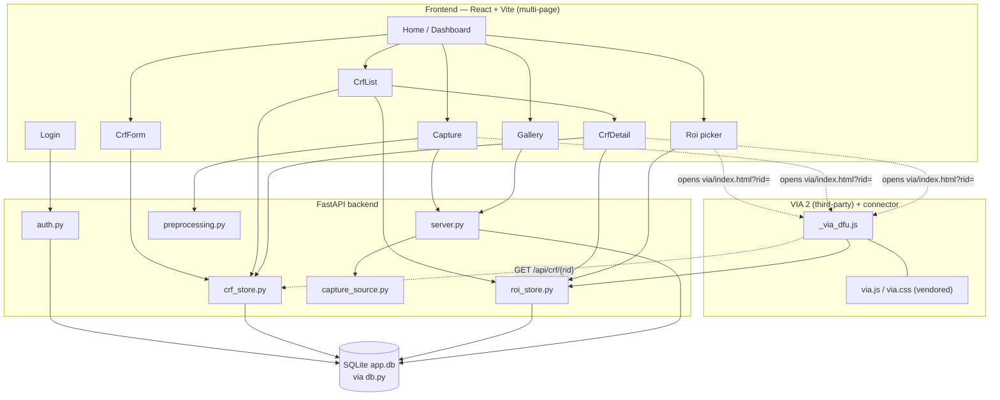

อัปเดตล่าสุด: 2026-08-08 18:00

# capture_app — เอกสารสรุปโปรเจกต์

โน้ตชุดนี้วิเคราะห์ `capture_app` ทั้งระบบ — แอปเก็บข้อมูลความเสี่ยงเท้าเบาหวาน (DFU) ของโรงพยาบาลพุทธชินราช พิษณุโลก ประกอบด้วย backend FastAPI + SQLite ([[server]]) และ frontend React + Vite (multi-page) แบ่งเป็น 4 หมวดตามลำดับความสำคัญ: **[[#1 File Dependency|ไฟล์]]** → **[[#2-api-endpoints|API]]** → **[[#3-shared-state|State]]** → **[[#4-feature-map|Feature]]**

## ภาพรวมสถาปัตยกรรม

**แนวคิดหลัก 3 อย่างที่ทำให้ระบบนี้ต่างจากแอปฟอร์มทั่วไป**:
1. **ลำดับบังคับ**: ต้องมีฟอร์ม CRF ก่อนถึงจะถ่ายภาพได้ (409 gate ใน [[api-post-capture]]) — ป้องกันภาพกำพร้าไม่มีเจ้าของ
2. **ภาพ 3 แบบต่อข้างเท้า**: 224×224 สำหรับเทรนโมเดล, ความละเอียดเต็ม (CLAHE) สำหรับมาร์ก ROI, สีดั้งเดิมก่อน CLAHE สำหรับ XAI/Grad-CAM overlay ในอนาคต — ดู [[preprocessing]]
3. **นโยบายมาร์ก ROI ตามผลตรวจ**: มาร์กเฉพาะข้างที่ Positive/ยังไม่มีผล ข้าง Negative ข้ามไปเพราะไม่มี LOPS/PAD ตามนิยาม — ดู [[feature-roi]] และ [[lib-roiStatus]]

---

## 1. File Dependency

หน้าที่/ตัวแปร-ฟังก์ชันหลัก/ผู้เรียก/สิ่งที่พึ่งพา ของไฟล์ซอร์สทุกไฟล์ในโปรเจกต์ (ไม่รวมไฟล์ build ผลลัพธ์ใน `static/`) — 51 โน้ต

**Backend (Python)**
[[server]] · [[db]] · [[auth]] · [[crf_store]] · [[roi_store]] · [[preprocessing]] · [[capture_source]] · [[migrate_to_sqlite]]

**Frontend — lib**
[[lib-api]] · [[lib-auth]] · [[lib-crfScoring]] · [[lib-crfTypes]] · [[lib-captureTypes]] · [[lib-utils]] · [[lib-roiStatus]]

**Frontend — components**
[[components-Navbar]] · [[components-DeleteConfirmDialog]] · [[components-ui-shadcn]]

**Frontend — pages**
[[pages-Home]] · [[pages-Login]] · [[pages-CrfForm]] · [[pages-CrfList]] · [[pages-CrfDetail]] · [[pages-Capture]] · [[pages-Roi]] · [[pages-Gallery]]

**Frontend — Vite entry scripts (main-\*.tsx)**
[[main-home]] · [[main-login]] · [[main-crf-form]] · [[main-crf-list]] · [[main-crf-detail]] · [[main-capture]] · [[main-roi]] · [[main-gallery]]

**Frontend — HTML entries + config**
[[html-index]] · [[html-login]] · [[html-crf-form]] · [[html-crf-list]] · [[html-crf-detail]] · [[html-capture]] · [[html-roi]] · [[html-gallery]] · [[vite-config]] · [[index-css]]

**VIA 2 annotation subsystem**
[[_via_dfu]] (ตัวเชื่อมที่ทีมเขียนเอง) · [[via-vendored]] (third-party, ไม่ได้วิเคราะห์ละเอียด)

**Tests**
[[conftest]] · [[test_api]] · [[test_auth]] · [[test_db]] · [[crfScoring-test]]

⚠️ **จุดที่ควรรู้**: [[migrate_to_sqlite]] ไม่ถูก import จากไฟล์ไหนเลย (ตั้งใจให้รันแยกด้วยมือครั้งเดียว ไม่ใช่ dead code จริง) — ดูรายละเอียดในโน้ตของมันเอง

---

## 2. API Endpoints

Method/ผู้เรียก/payload/response/ไฟล์ backend ที่ handle ของทุก endpoint — 23 โน้ต

**Session/health (ไม่ต้อง auth หรือเป็นตัว auth เอง)**
[[api-get-health]] · [[api-post-login]] · [[api-post-logout]] · [[api-get-session]]

**Cases / CRF forms**
[[api-get-cases]] · [[api-post-session-new]] · [[api-get-crf-list]] · [[api-get-crf-pid]] · [[api-post-crf]] · [[api-delete-crf-pid]] · [[api-get-nurses]] · [[api-post-nurses]]

**Capture / preprocessing / commit / files**
[[api-post-capture]] · [[api-post-preprocess]] · [[api-post-commit]] · [[api-get-manifest]] · [[api-get-file]] · [[api-get-operators]] · [[api-post-operators]]

**ROI**
[[api-get-roi-list]] · [[api-get-roi-rid]] · [[api-post-roi-rid]] · [[api-delete-roi-rid]]

---

## 3. Shared State

ตัวแปร/ข้อมูลที่ถูกใช้ร่วมกันข้ามไฟล์ — ตาราง SQLite, cookie, localStorage, query param, และ global state ของ VIA — 13 โน้ต

**Auth/session**
[[session-cookie]]

**ตาราง SQLite (`data/app.db`, เจ้าของร่วมคือ [[db]])**
[[db-cases-table]] · [[db-crf_forms-table]] · [[db-captures-preprocessing-tables]] · [[db-commits-table]] · [[db-roi_annotations-table]] · [[db-nurses-table]] · [[db-operators-table]] · [[db-settings-audit-tables]]

**Client-side state**
[[localstorage-capture_records]] · [[url-query-params]]

**VIA 2 subsystem state**
[[via-global-state]] · [[dfu-rid-constant]]

---

## 4. Feature Map

มองจากมุมผู้ใช้ — แต่ละฟีเจอร์เกี่ยวข้องกับไฟล์/API/state ตัวไหนบ้าง — 8 โน้ต

[[feature-dashboard]] (หน้าแรก) → [[feature-login]] (เข้าสู่ระบบ) → [[feature-crf-form]] (กรอกฟอร์ม CRF-07) → [[feature-capture]] (ถ่ายภาพ) → [[feature-roi]] (ทำ ROI) → [[feature-crf-list]] (ประวัติการบันทึก) · [[feature-crf-detail]] (รายละเอียดเคส) · [[feature-gallery]] (คลังภาพ)

ลำดับด้านบนคือ flow การใช้งานจริงของพยาบาลหนึ่งเคส ตั้งแต่ login จนถึงมาร์ก ROI เสร็จ — ส่วน [[feature-crf-list]]/[[feature-crf-detail]]/[[feature-gallery]] เป็นมุมมอง "ดูย้อนหลัง" ที่ใช้ได้ทุกจุดของ flow

---

## ขอบเขตที่จงใจไม่ลงรายละเอียด

- **[[via-vendored]]** (VIA 2 ต้นฉบับจาก Oxford VGG) — เป็น third-party ~800+ บรรทัด ไม่ใช่โค้ดที่ทีมเขียน จึงบันทึกแค่ภาพรวมและจุดต่อกับ [[_via_dfu]] เท่านั้น
- **[[components-ui-shadcn]]** — 11 ไฟล์ที่ได้จาก `npx shadcn add` (Radix UI + CVA + Tailwind) ไม่ใช่ business logic จึงรวมเป็นโน้ตเดียวแทนแยกไฟล์ละโน้ตเต็มรูปแบบ
- โฟลเดอร์ `static/` (ผลลัพธ์ `npm run build`) ไม่มีโน้ตแยก เพราะเป็นไฟล์ที่ generate จาก `frontend/src/` ทุกครั้งที่ build ไม่ใช่ source ที่แก้ไขตรง
